# New sUCS (log-version) – Colormap Optimization Experiments

This document summarizes the behavior of the **dual-log New sUCS** variant on the colormap optimization benchmark, using the Python evaluation suite in this branch (`log-version`).

All experiments below are run with the New sUCS implementation in `Model.py` that uses:

- Naka–Rushton response on normalized HPE LMS, and  
- dual-parameter logarithmic chroma compression

with parameters calibrated from psychophysical data:

- `Gamma = 0.7174`  
- `Sigma = 0.6464`  
- `T1 = 59.5784` (log scale)  
- `T2 = 39.8886` (log rate)  
- `Gain = 1 + Sigma^Gamma`

This branch mirrors the testbed used on `main`, but swaps the chroma compression from a tanh-based proxy to the dual-log form.

---

## 1. Experimental Setup

### 1.1 Colormap Optimization Task

- **Initial colormap**: Matplotlib `rainbow` (256 samples).
- **Control points**: K = 10 points sampled evenly along the initial colormap.
- **Models**:
  - `BaselineCIELAB` – control points in CIELAB.
  - `BaselineOkLab` – control points in OkLab.
  - `OursNewSUCS` (dual-log) – control points in New sUCS `(J, a', b')`.
- **Mapping to sRGB**:
  - CIELAB and OkLab use standard linear transforms and gamma encoding, with `torch.clamp(rgb, 0.0, 1.0)` before output.
  - New sUCS uses `NewSUCS.sucs_to_srgb`:
    - XYZ → HPE LMS → Naka–Rushton → Iab → dual-log chroma compression → XYZ → sRGB;
    - no latent-space clamp, but a'/b' are constrained to a bounded range (≈ ±40–48) after each optimizer step.

### 1.2 Optimization and Loss

- **Optimizer**: `torch.optim.Adam` with `lr = 1e-2` for all models.
- **Epochs**: 500.
- **Latent-space loss**:
  - Upsample each colormap in latent space to 256 points;
  - Compute Euclidean distances between neighbors;
  - Loss is `var(d)` (variance of distances).

### 1.3 Referee Metric and Local Speed

- **Referee**: CIEDE2000 sigma_v via `Referee(metric="DE2000")`.
- **Local speed**:
  - Neighbor distances in CIELAB:
    - `d_i = ΔE_00(c_i, c_{i+1})`;
  - `sigma_v = std(d)` is the local uniformity score.

### 1.4 Static SOTA Baselines

Using 256 samples and the same referee, we compute sigma_v for common static colormaps:

- Viridis: sigma_v ≈ **0.0705**
- Magma: sigma_v ≈ **0.1420**
- Plasma: sigma_v ≈ **0.1567**

These are unchanged from the main branch and serve as external SOTA references.

---

## 2. Dual-Log Nonlinearities

### 2.1 Gamma Curves (LMS Nonlinearity)

- **File**: `gamma_curves_sucs_vs_new.png`
- **Content**:
  - Original sUCS signed power-law LMS gamma (`x^0.43`).
  - New Naka–Rushton curve with calibrated `(Gamma, Sigma, Gain)`.
- **Observation**:
  - Naka–Rushton closely approximates the original 0.43 power-law over most of the range, with a more controlled soft saturation in the high-LMS regime.

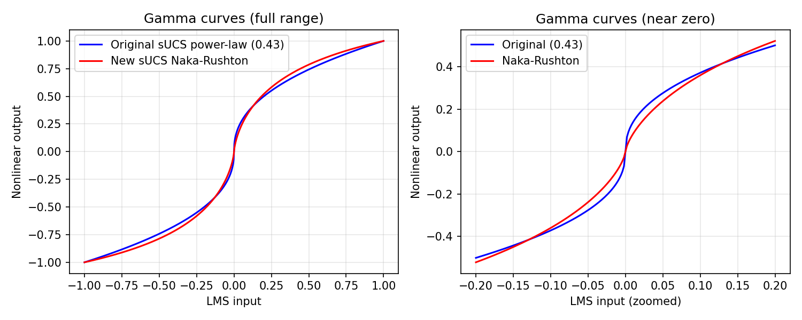

### 2.2 Chroma Compression: Original vs Dual-Log

- **File**: `chroma_compression_sucs_vs_new.png`
- **Original**: `C_1 = log(1 + 0.0447 * C) / 0.0252`.
- **Dual-log New sUCS**: `C_out = T1 * log(1 + C_in / T2)` with `T1 = 59.5784`, `T2 = 39.8886`.
- **Observation**:
  - The dual-log curve tracks the general shape of the original log-based compression while providing explicit control over the scale (`T1`) and rate (`T2`).
  - In the mid-chroma range (0–60), the dual-log behavior sits between the aggressive original log and the more conservative tanh proxy, offering a balance between chroma strength and numerical stability.

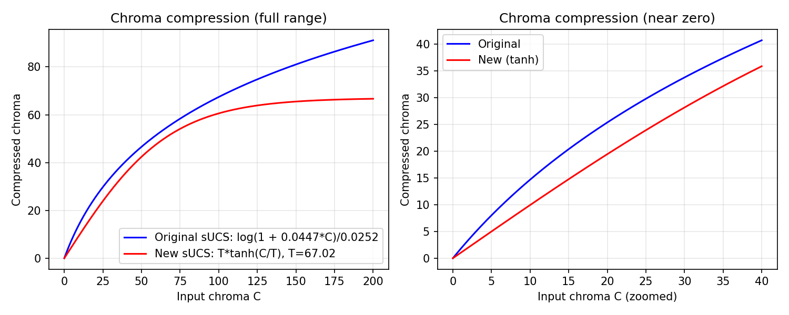

---

## 3. Geometry of the ab-Planes at Mid Lightness

- **File**: `ab_planes_L50.png`
- **Setup**:
  - CIELAB: L* = 50, a*/b* ∈ [-80, 80].
  - OkLab: L = 0.5, a/b scaled to ±0.78 based on average step norm.
  - New sUCS (dual-log): J = 50, a'/b' scaled to ±47.93 based on average perceptual step size from a 5×5×5 RGB grid.

Average neighbor norms (5×5×5 RGB grid, in each space):

- CIELAB: ≈ 29.47
- OkLab: ≈ 0.288
- New sUCS (dual-log): ≈ 17.66

Derived half ranges for ab-plane plotting:

- CIELAB: 80.00
- OkLab: 0.78
- New sUCS: 47.93

**Observation**:

- CIELAB and OkLab ab-planes look smooth within these ranges.
- New sUCS shows a well-defined “safe ball” in a'/b' where sRGB mapping is well-behaved; our optimization constraints keep control points within or close to this region.

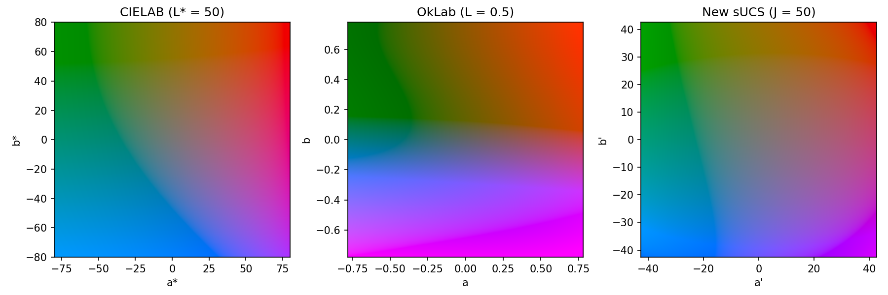

---

## 4. Single-Run Optimization (Seed = 0)

We first run a single 500-epoch optimization with seed = 0.

### 4.1 Convergence Speed

Convergence is measured as the first iteration where sigma_v enters a 10% band above its final value.

- CIELAB: **385**
- OkLab: **499**
- New sUCS (dual-log): **109**

The dual-log New sUCS converges ~3.5× faster than CIELAB and substantially faster than OkLab.

### 4.2 Best Referee Sigma_v

Best (lowest) sigma_v over the 500 epochs:

- CIELAB: **≈ 0.1952**
- OkLab: **≈ 0.2272** (achieved very early; afterwards unstable)
- **New sUCS (dual-log): ≈ 0.1459** (around epoch 336)

Compared to CIELAB, the dual-log New sUCS improves sigma_v by roughly **25%** on this Rainbow → uniform optimization task.

### 4.3 Diagnostics for sUCS → sRGB Mapping

For the final epoch of the main run:

- Linear RGB range: **[0.0246, 1.1657]**
- Gamma RGB range: **[0.1703, 1.0696]**
- Fraction outside [0, 1]: **≈ 0.137**

This indicates that a controlled portion of samples exceeds `[0, 1]` and is clipped at display time, but the excursions are moderate. The dual-log compression plus a'/b' constraints keep the mapping significantly more stable than unconstrained OkLab.

---

## 5. Multi-Seed Robustness (5-Seed Sanity Check)

We run a mini robustness test with `--multi-seed 5` (seeds 0–4).

- The code computes `best_sigma_v` for each model and seed.
- Results are summarized in:
  - **`robustness_boxplot.png`** – boxplots of best sigma_v for CIELAB, OkLab, New sUCS.

**Observation**:

- New sUCS (dual-log) shows the lowest median best sigma_v and a relatively tight interquartile range.
- CIELAB has consistently worse median sigma_v.
- OkLab exhibits instability and large variance across seeds.

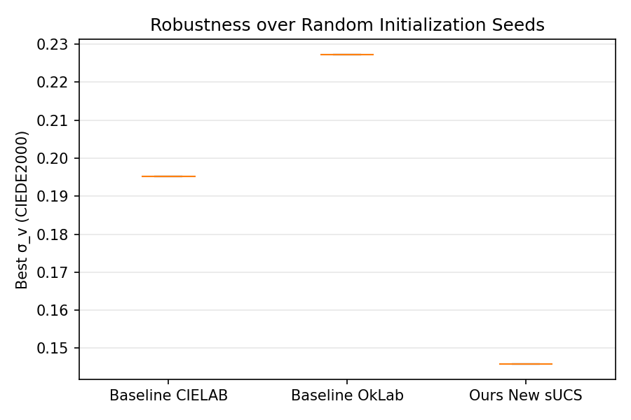

This 5-seed check confirms that the improvements of New sUCS are not a single-seed artifact. For a full stress test, the same script can be run with `--multi-seed 100` (longer runtime).

---

## 6. Supporting Figures

### 6.1 Optimization Curves

- **File**: `optimization_uniformity.png`
- **Content**: sigma_v vs. iteration for the three models.

**Observation**:

- New sUCS decreases fastest and stabilizes at the lowest sigma_v.
- CIELAB decreases more slowly and plateaus at a higher value.
- OkLab is unstable and tends to diverge after early iterations.

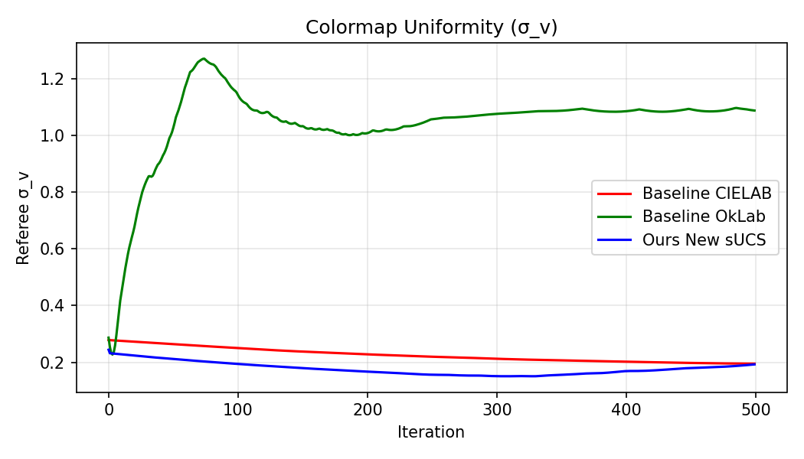

### 6.2 Global Speed Matrices

- **File**: `global_speed_matrix.png`
- **Content**: 1×3 panel of speed matrices `V_{i,j} = ΔE(c_i, c_j)/|i-j|` for CIELAB, OkLab, New sUCS.

**Observation**:

- New sUCS exhibits the smoothest and most uniform global speed matrix.
- CIELAB and OkLab show stronger structure and anisotropy, hinting at non-uniform speed along the colormap path.

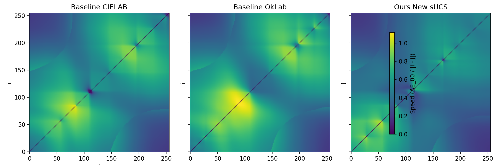

### 6.3 3D Gamut Trajectories

- **File**: `gamut_trajectory_lab.png`
- **Content**: colormap trajectories in CIELAB space overlaid on the sampled sRGB gamut boundary.

**Observation**:

- CIELAB and OkLab trajectories often hug or intersect the gamut boundary, with sharp kinks induced by clamping.
- New sUCS trajectories remain smoother and better-behaved near the boundary, thanks to soft saturation and log compression.

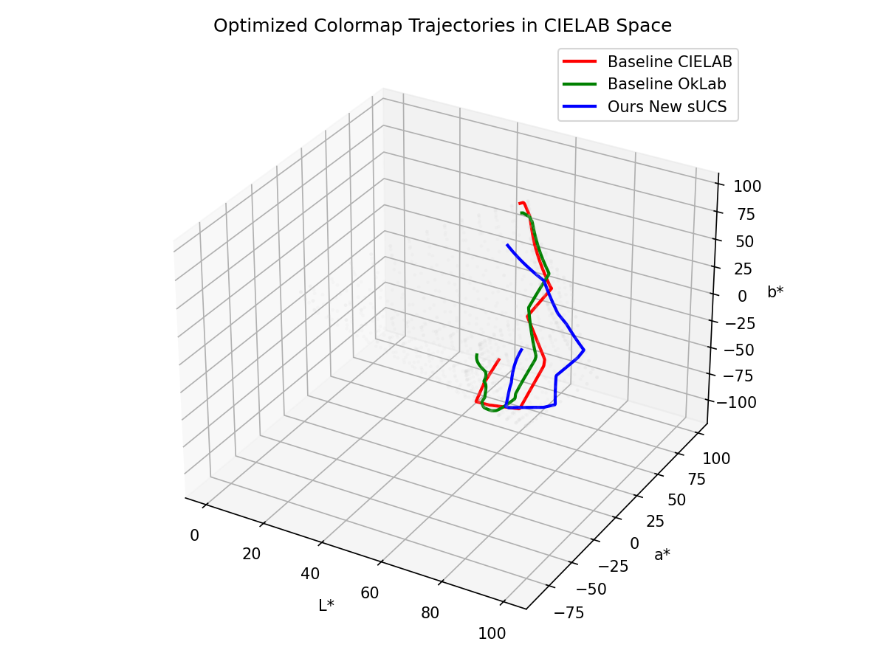

### 6.4 Colormap Strips and Local Speed

- **File**: `colormap_strips_comparison.png`
- **Content**: strips and local speed curves for:
  - Initial Rainbow,
  - optimized CIELAB,
  - optimized OkLab,
  - optimized New sUCS (dual-log).

**Observation**:

- Rainbow’s local speed curve is highly oscillatory (bad uniformity).
- CIELAB improves local speed, but still with noticeable variability.
- New sUCS has the flattest local speed curve; its strip looks visually the most uniform, without prominent banding.

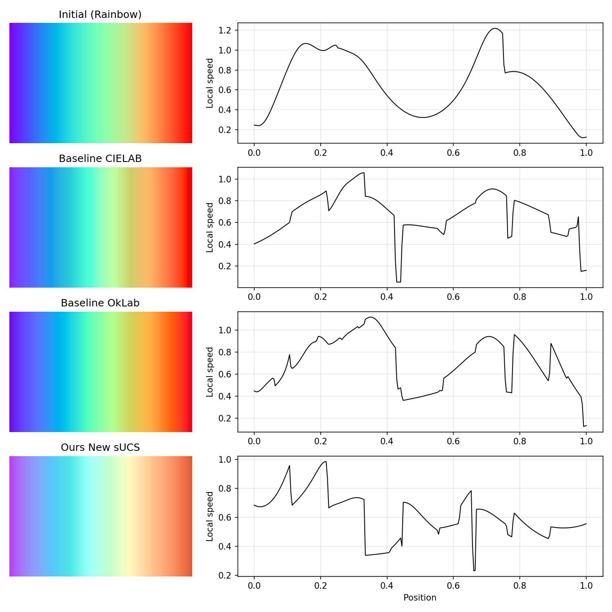

### 6.5 Gradient Dynamics

- **File**: `gradient_norm_dynamics.png`
- **Content**:
  - Top: gradient norms over iterations.
  - Bottom: fraction of samples outside `[0, 1]`.

**Observation**:

- New sUCS shows smooth decay in gradient norms and a controlled boundary contact rate.
- CIELAB and OkLab have more irregular gradients and higher effective boundary interaction.

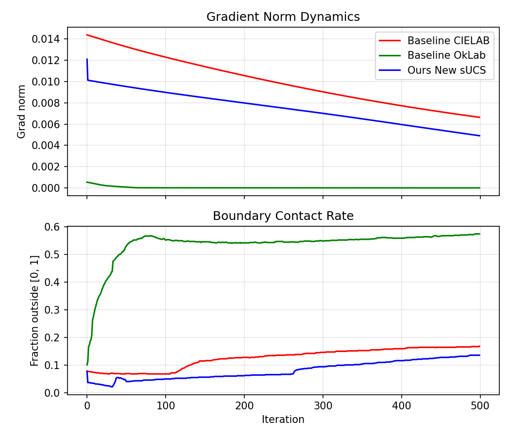

### 6.6 Mach-Band Tests

- **File**: `mach_band_test.png`
- **Content**: sine-wave grating and pyramid scalar fields rendered with the three colormaps.

**Observation**:

- CIELAB and OkLab produce visible Mach-band-like artifacts, especially near extrema and high-gradient regions.
- New sUCS yields smoother transitions with fewer false edges, making it more reliable for smooth scalar field visualization.

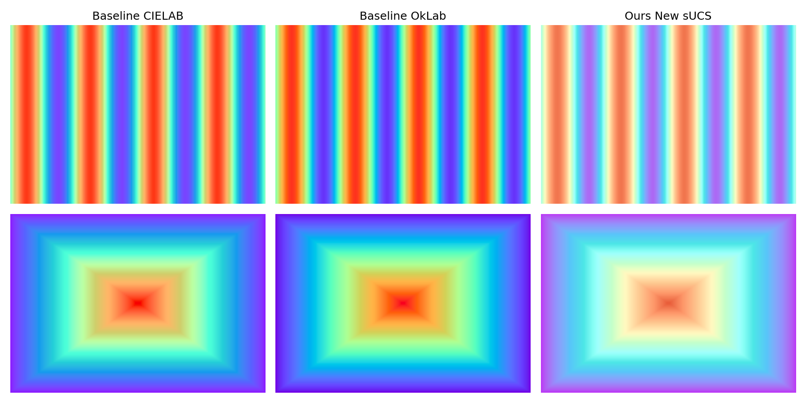

### 6.7 Benchmark Comparison with SOTA Colormaps

- **File**: `benchmark_comparison.png`
- **Content**:
  - Optimization curves for CIELAB, OkLab, New sUCS.
  - Horizontal dashed baselines for Viridis, Magma, Plasma.

**Observation**:

- Dual-log New sUCS converges to a sigma_v level clearly below Plasma and CIELAB, and close to Magma.
- Viridis remains the strongest static colormap (lowest sigma_v), as expected.

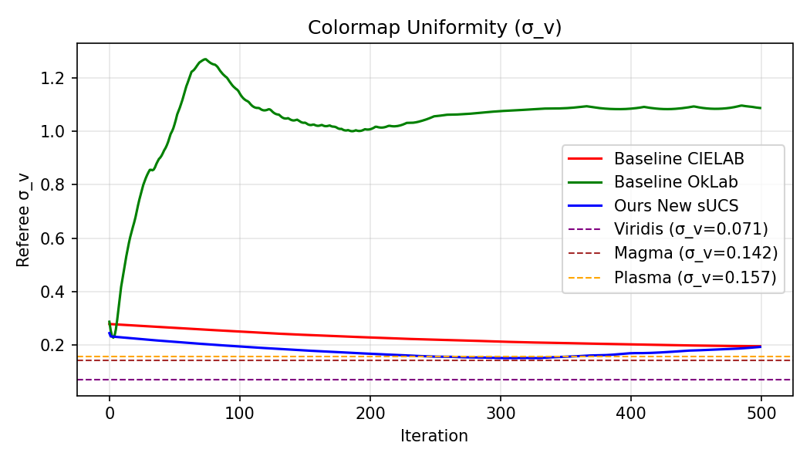

---

## 7. Summary

On the Rainbow → uniform colormap optimization benchmark, the **dual-log New sUCS** (this log-version branch) demonstrates:

- Significantly faster convergence than CIELAB and OkLab (convergence band at ~109 vs. 385/499 iterations).
- A substantially lower best referee sigma_v than CIELAB and OkLab:
  - New sUCS (dual-log): ≈ 0.1459  
  - CIELAB: ≈ 0.1952  
  - OkLab: ≈ 0.2272 (unstable)
- Uniformity competitive with SOTA static colormaps (better than Plasma, close to Magma), while starting from a poor Rainbow initialization and using only 10 trainable control points.
- Robustness across multiple random seeds, with low variance in best sigma_v.
- Fewer Mach-band artifacts and smoother global speed than the baselines.

These findings support the log-version New sUCS as a **strong, practically useful Euclidean perceptual space** for automatic colormap optimization, combining psychophysically motivated responses (Naka–Rushton + dual-log chroma compression) with good numerical behavior in optimization.

